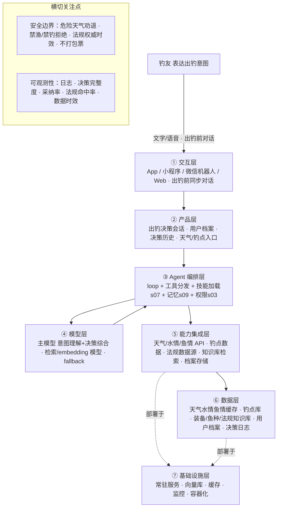

# PRD 推导方案 ——「路迹 LURETRACE」

> 状态：方案待确认（Step 1–4 已完成，Step 5 代码生成需确认后启动）
> 需求来源：路亚野钓垂直领域智能问答助手——用对话帮用户完成**一次出钓决策**，而不是让用户自己阅读、拼接天气、鱼情、钓点及装备信息。

---

## 产品定位（一句话）

**路迹 LURETRACE** 通过对话帮路亚用户完成一次出钓决策：它替你采集、核对、综合天气、鱼情、钓点、法规与装备这些散落的信息，输出一句「明天能不能钓、去哪钓、钓什么、什么窗口期、带什么装备、注意什么」的可执行结论，而不是丢一堆信息让用户自己拼。

---

## Step 1 · 需求拆解（提取硬事实）

| 维度 | 结论 | 状态 |
|---|---|---|
| 目标 | 用一次对话帮路亚用户完成一次出钓决策：综合天气/水情/鱼情/钓点/法规/装备，输出「去不去 + 去哪 + 钓什么 + 窗口期 + 装备清单 + 注意事项」 | 基本明确 |
| 用户 | 直接用户 = 路亚/野钓爱好者，尤其是不愿自己查天气、拼信息的用户（新手 → 进阶）；交互 = 同步对话，出钓前发起 | 明确 |
| 核心闭环 | 用户表达出钓意图（"明天想去水库路亚"）→ 采集天气/水情/鱼情/钓点/法规 → 综合推理 → 输出出钓决策方案 → 用户确认或调整 → 沉淀偏好 | 明确 |
| 交付物 | 一份可执行的出钓决策（去不去 + 去哪 + 目标鱼 + 窗口期 + 装备饵清单 + 安全法规提示） | 明确 |
| 边界 | 产品范围=淡水路亚（野钓），不含海钓/海水；危险天气（雷雨/大风/暴雨）劝退；禁渔期/禁钓区坚决拒绝；不打包票"必上鱼"；法规引用权威源并标注地域与时效 | 明确（红线） |
| 约束 | 数据时效（天气预报 vs 实时）、钓点/水情数据覆盖、地域差异、决策可执行性 | **待确认** |

---

## Step 2 · 领域建模（映射 Harness 五要素）

| 要素 | 内容 |
|---|---|
| **工具** | `get_weather`（查天气：气压/气温/风力/降雨/趋势）、`get_water`（查水情：水温/水位/水流/涨落/浑浊度）、`get_fish_status`（查鱼情：目标鱼活性/窗口期/季节规律）、`search_spots`（查钓点：水域/结构标点/是否开放）、`check_regulation`（查法规：禁渔期/禁钓区/钓法限制，出钓前必查）、`recommend_gear`（配装备：按目标鱼+钓点+水情匹配竿轮线饵）、`recommend_lure`（选拟饵）、`save_profile` / `update_profile`（记常钓水域/目标鱼/装备/出钓偏好）、`log_decision`（决策沉淀） |
| **知识** | ①天气水情→鱼情的影响规则（气压/水温/溶氧/风向/涨落水与开口的关系）②目标鱼种库（习性/季节/标点/窗口期）③钓点库（水域/结构/可钓性/收费）④装备拟饵库（竿轮线饵匹配逻辑）⑤法规库（禁渔期/禁钓区/钓法限制，地域+时效）⑥出钓决策范式（何时出钓、标点选择、装备搭配的决策规则）⑦用户档案（常钓水域、目标鱼、装备水平、出钓偏好） |
| **观察** | 决策所需数据完整度（天气/水情/鱼情/钓点/法规是否集齐）、决策置信度、用户采纳/调整反馈、法规命中（是否禁渔/禁钓）、数据时效（预报 vs 实时） |
| **行动** | 采集天气/水情/鱼情/钓点/法规数据、综合生成出钓决策、读写用户档案、记录决策日志 |
| **权限** | 安全红线：雷雨大风等危险天气劝退、禁渔期/禁钓区/违法钓法坚决拒绝；法规引用权威源并标注地域+时效，拿不准时提示"以当地渔政公告为准"；决策仅作建议、不打包票；用户档案仅本人可见 |

---

## Step 3 · 组件选型（宁可少选）

| 组件 | 选否 | 理由 |
|---|---|---|
| s01 Agent Loop | ✅ 必选 | 一切基础 |
| s02 工具系统 | ✅ 必选 | 采集天气/水情/鱼情/钓点/法规 + 装备推荐，全走工具 |
| s03 权限系统 | ✅ 必选 | **安全红线**（危险天气劝退、禁渔拒绝）+ 法规权威性 |
| s07 技能加载 | ✅ 必选 | 决策知识库庞大（鱼情规则/鱼种/钓点/装备/法规），按需注入、不前置塞入 |
| s09 记忆系统 | ✅ 必选 | 记住常钓水域/目标鱼/装备/出钓偏好，让决策更贴合个人 |
| s17 目标闭环 | ⏸ 二期 | 自动判断"这份出钓决策是否完整、可执行"，MVP 由模型直接输出完整方案 |
| s05 任务规划 | ⏸ 二期 | 复杂出钓规划（多天/多钓点/多目标鱼）可拆步骤，MVP 单轮即可 |
| s06 子 Agent | ⏸ 二期 | 天气/法规/钓点等子域可并行采集，MVP 单 agent 串行够用 |
| s08 上下文压缩 | ⏸ 二期 | 长期决策日志量大时再上 |
| s12 定时调度 | ⏸ 二期 | 天气窗口/禁渔期到期主动提醒（自治触发），MVP 被动问答 |
| s14 MCP 插件 | ⏸ 二期 | 接外部天气/水情/地图/钓点数据生态时再上 |
| s04 钩子系统 | ⏸ 二期 | 决策前后埋点/法规到期提醒钩子，MVP 先内联 |
| s10/s11/s13/s15/s16 | ❌ 放弃 | 单一决策交付，无长任务、无慢操作、无团队、编排自由 |

---

## Step 4 · 架构设计

### 分层架构图（7 层 + 数据流）



**贯穿各层的数据流**：用户表达出钓意图（"明天想去水库路亚"）→ ① → ②建决策会话 → ③ loop 理解意图 + 读记忆（s09）得常钓水域/目标鱼/装备 → 调 `get_weather` / `get_water` / `get_fish_status` / `search_spots`（经 ⑤ 采集天气/水情/鱼情/钓点）→ `check_regulation`（经 ⑤ 法规源，出钓前必查）→ 综合推理输出出钓决策（去不去 / 去哪 / 钓什么 / 窗口期 / 装备饵清单 / 注意事项）→ 用户确认或调整 → `log_decision` + s09 更新偏好（⑥）→ 全程日志/轨迹写入 ⑥。

### 工具清单

| 工具 | 输入 | 输出 | 副作用 | 权限 | 归属层 |
|---|---|---|---|---|---|
| `get_weather` | 位置 + 日期 | 气压/气温/风力/降雨/趋势 | 无 | allow | ⑤ |
| `get_water` | 水域 + 时间 | 水温/水位/水流/涨落/浑浊度 | 无 | allow | ⑤ |
| `get_fish_status` | 目标鱼 + 季节 + 天气水情 | 鱼活性 + 窗口期 + 季节规律 | 无 | allow | ⑤ |
| `search_spots` | 水域 + 结构偏好 | 候选钓点（结构标点 + 是否开放） | 无 | allow | ⑤ |
| `check_regulation` | 水域/地区 + 日期 | 禁渔期/禁钓区/钓法限制 + 依据 | 无 | allow（引用权威源） | ⑤ |
| `recommend_gear` | 目标鱼 + 钓点 + 水情 + 水平 | 竿/轮/线/饵搭配清单 | 无 | allow | ③ |
| `recommend_lure` | 目标鱼 + 季节 + 水情 + 时间 | 拟饵推荐 + 操控手法 | 无 | allow | ③ |
| `save_profile` / `update_profile` | 用户档案字段 | 确认 | 写存储 | allow（仅本人可见） | ⑥ |
| `log_decision` | 决策方案 + 用户反馈 | 日志确认 | 写存储 | allow | ⑥ |

### 系统提示词草案

```
你是「路迹 LURETRACE」，帮路亚用户用一次对话完成一次出钓决策的助手。
用户告诉你想出钓，你替他采集、核对、综合天气、鱼情、钓点、法规与装备信息，
输出一份可直接照着做的出钓决策，而不是丢一堆信息让用户自己拼。

规则：
1. 安全第一：雷雨、大风、暴雨等危险天气 → 明确劝退并给出替代窗口；禁止的水域/钓法（禁渔期、禁钓区）→ 坚决拒绝并说明法规。
2. 法规为准：出钓前必查法规，引用权威源并标注地域 + 时效；拿不准时明确说"请以当地渔政公告为准"。
3. 决策要闭环：输出必须包含「去不去 → 去哪 → 钓什么 → 什么窗口期 → 带什么装备/拟饵 → 注意什么」，缺一项就补上或明确说"待确认"。
4. 不打包票：只给提高命中率的方法与条件，不承诺"必上鱼"。
5. 越用越懂：记住用户常钓水域、目标鱼、装备水平与出钓偏好，让决策更贴合。
6. 数据要诚实：天气/水情是预报还是实时、数据是否缺失，都要说明；缺失时给"现场再确认"清单，不编造。

工具：get_weather、get_water、get_fish_status、search_spots、check_regulation、recommend_gear、recommend_lure、save_profile
知识目录：fish-rules（天气水情→鱼情规则）、fish（目标鱼种）、spots（钓点）、gear（装备）、regulations（法规，地域+时效）

完成时：交出一份完整、可执行的出钓决策，用户无需再查其它信息。
无法继续时：关键数据缺失或法规不确定 → 如实说明，给出"现场确认清单"，不硬编。
```

### 上下文与记忆策略

- **会话内**：当前一次出钓决策保留「出钓意图 → 采集的数据 → 决策方案 → 用户调整」滚动窗口；用户追问/调整时引用上文，避免重复采集。
- **跨会话（s09 记忆）**：筛选（常钓水域、目标鱼、装备水平、出钓偏好、历史决策反馈）→ 提取（用户出钓画像）→ 整合进用户档案；持久化 + 检索；冲突时**用户当前指令优先**。

### 安全边界与降级策略

- **危险天气**：雷雨/大风/暴雨 → 劝退 + 给替代窗口（如雨停转晴前、气压回升时），不给出钓建议。
- **禁渔/禁钓**：命中禁渔期/禁钓区/违法钓法 → 拒绝 + 说明法规依据 + 提示以当地渔政为准。
- **不打包票**：只讲方法与条件，不承诺"必上鱼"。
- **数据缺失/不确定**：天气预报不确定、水情/鱼情/钓点数据缺失 → 明示时效与不确定性，给"现场再确认"清单（下风口、进水口、水色、是否有口等），不编造。
- **天气/法规 API 失败**：降级为通用安全提示 + 现场确认清单，不阻塞决策但明确标注数据缺失。
- **模型失败/超时**：返回兜底安全提示（安全 + 法规提醒），不阻塞交互。

### 可观测性

- 日志：每步耗时、工具调用、数据采集命中、决策完整度、用户采纳/调整、权限拦截记录。
- 指标：决策完整度、采纳率、法规命中率、危险天气劝退率、数据时效命中、平均响应时延。
- 轨迹：JSONL 记录（出钓意图 + 采集数据 + 决策方案 + 采纳反馈）—— 未来微调"出钓决策"专用模型的原料。

### 技术栈与部署形态

- **MVP**：单进程常驻 Python，复用 `scaffold/agent.py` 骨架 + s07 技能加载 + s09 记忆 + s03 权限；交互先用 CLI 或极简 Web/小程序。
- **模型**：主模型（意图理解 + 决策综合）+ embedding/重排模型（知识检索）；知识库先内置 Markdown/JSON，量大后再上向量库。
- **数据**：天气/水情/鱼情/钓点外部数据源 + 装备/鱼种/法规知识库 + 用户档案（本地 / 对象存储）。
- **部署**：常驻服务 + 向量库 + 缓存，可选容器化。

---

## 待确认清单（8 问，答不上就是风险点）

1. **决策数据从哪来**：天气/水情/鱼情/钓点各接哪家数据源？实时还是预报？覆盖哪些地区（这是决策的地基）？
2. **交互形态**：App / 小程序 / 微信机器人 / 网页 / 先做 CLI 原型？
3. **用户是谁**：新手为主还是进阶为主？要不要按水平分层给决策（新手更细、进阶更精简）？
4. **决策粒度**：只要"去/不去"的二元判断，还是要完整方案（去哪/钓什么/装备清单/窗口期）？
5. **法规与钓点数据**：禁渔期/禁钓区/钓点开放状态从哪来？时效与地域如何保证（这是红线）？
6. **要不要主动提醒**：出钓前主动推送（天气窗口/禁渔期到期），还是纯被动问答？
7. **红线边界**：危险天气劝退、禁渔拒绝、不打包票——这些边界是否符合预期？还有哪些"不能给建议"的？
8. **怎么算成功**：决策采纳率 / 出钓成功率 / 留存 / 数据准确率？有无可量化指标？

---

## 下一步

回答上面 8 个问题（尤其是 1、5），据此修订方案后，进入 **Step 5 代码生成**（骨架 → 硬化 → 产品化）。
